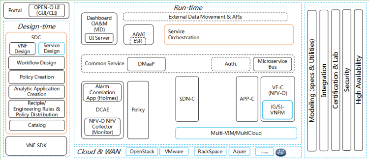
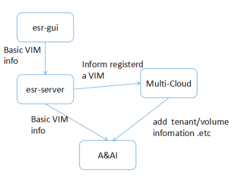
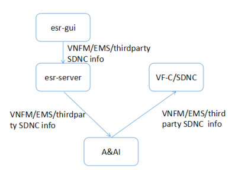
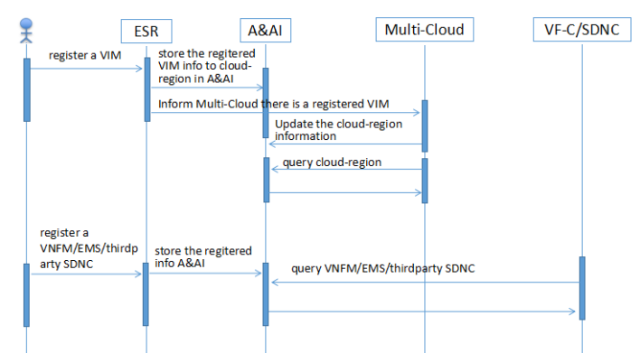

.. This work is licensed under a Creative Commons Attribution 4.0 International License.
.. _architecture:

Architecture
------------

ESR contains two components: esr server module and esr gui module

- ESR
    - ESR server
    - ESR gui

ONAP-level Architecture
^^^^^^^^^^^^^^^^^^^^^^^

In ONAP architecture, ESR is a sub-project of A&AI. It provide a single point for users to manage the external system information. It provides a way to register/unregister external system dynamically.

How ESR works
^^^^^^^^^^^^^^^^^^^^^^^

The user register external system through esr-gui, esr-server will store the external system information to A&AI. And the other components such as VF-C/SDNC/Multi-Cloud then can query the external system information form A&AI. The process of VIM register may be a bit different from the VNFM/EMS/thirdparty SDNC. That because the registered VIM information is some basic information such as region/version/auth-url that things, Multi-Cloud will update the cloud information with more details, such as the volume and tenant details. The VNFM/EMS/thirdparty SDNC will not be updated by VF-C and SDNC.

The complete workflow is shown below in the form of a sequence diagram.

